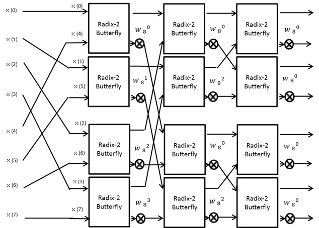

# ButterFly unit of DIF FFT with pipelined multiplier
 The verilog code together with cocotb testbench of BFU unit of a DIF FFT processor. The module supports 16-bit word with Q8 fixed point format (can be changed). However, if you look at the inputs {`a`, `b`} and outputs {`c_plus`, `c_minus`} you will notice they are 32-bits wide; that is due to FFT works in the complex domain.

 

 The width of inputs and outputs can be easily modified to accomodate larger bit width.

 #Operation 

 This module is the building block of any DIF FFT architecture, whether your architecture is: -
 * memory based FFT
 * pipelined FFT
 * parallel FFT

this will be your building block you can put it in a chain to build a pipelined FFT.


putting them in parallel.



or mapping all the samples from an external memory as in memory based FFT.


this module is used to implement the butterfly diagram of FFT such as the one shown in this fig (image for 8 point FFT).


# Testbench Dependencies 

to run the tests you should have installed [cocotb](https://github.com/cocotb/cocotb) python based testbench environment and [fxpmath](https://francof2a.github.io/fxpmath) fixed point package in python, also you should have iverilog installed as a backend for cocotb.

```shell
sudo apt-get install build-essential libboost-dev iverilog
pip install cocotb
pip install fxpmath
```
# Running Testbench
in the main directory simply hit

```Makefile
make
```

you should then the results of the simulation compared to that of the model.

```log
   101.00ns INFO     cocotb                             C_PLUS_real Expected: 21.3663  HW: 21.36328125
   101.00ns INFO     cocotb                             C_PLUS_img Expected: -79.69875  HW: -79.6953125
   101.00ns INFO     cocotb                             C_MINUS_real Expected: 74.2936029669391  HW: 74.3046875
   101.00ns INFO     cocotb                             C_MINUS_img Expected: 9.632465034627202  HW: 9.57421875
   101.00ns INFO     cocotb.regression                  test_bfu_fft passed
   101.00ns INFO     cocotb.regression                  **************************************************************************************
                                                        ** TEST                          STATUS  SIM TIME (ns)  REAL TIME (s)  RATIO (ns/s) **
                                                        **************************************************************************************
                                                        ** test.test_bfu_fft              PASS         101.00           0.02       4653.93  **
                                                        **************************************************************************************
                                                        ** TESTS=1 PASS=1 FAIL=0 SKIP=0                101.00           0.34        299.22  **
                                                        **************************************************************************************

```

# Architecture


# generating rom file for TW ROM

under `/scripts` directory we have the script `generate_tw_rom.py`

usage: -

```shell

./scripts/generate_tw_rom.py -h
**twiddle factors rom generator for FPGA version 1.0

USAGE:-
     generate_tw.rom.py -p <fftPoints> -w <wordLength> -q <qFixedPointLoc>

```


